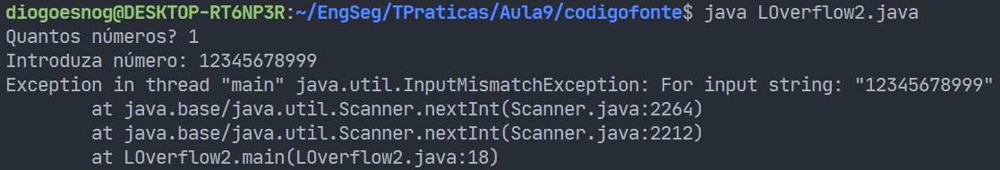
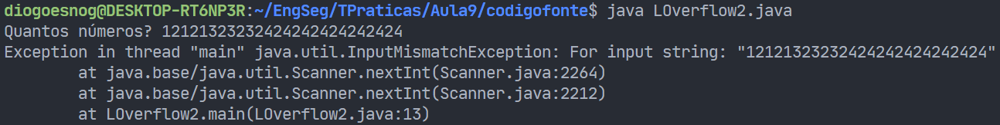
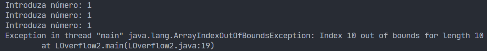
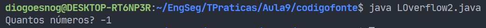
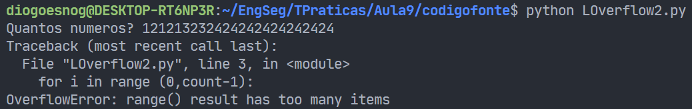

# Pergunta 1 - *Buffer Overflow*

Todas as imagens e outros ficheiros considerados relevantes para o entendimento complementar da resolução a todas as questões encontram-se listados na secção de [**Notas/Observações Finais**](#notasobservações-finais).

1. [**Pergunta P1.1**](#) - ***Buffer Overflow* em várias linguagens**
   - Análise do programa `LOverflow2` em três linguagens distintas
   - Compreensão do comportamento do programa

2. [**Pergunta P1.2**](#) - ***Buffer Overflow***
   - Análise dos programas `RootExploit` e `0-simple` escritos em C
   - Deteção vulnerabilidade de *Buffer Overflow* existente
   - Exploração dessa vulnerabilidade

3. [**Pergunta P1.3**](#) - ***Read Overflow***
   - Análise do programa `ReadOverflow` escrito em C

4. [**Pergunta P1.4**](#) - ***Buffer Overflow***
   - Compilação e execução do programa `1-match` escrito em C
   - Conceitos *little-endian* e *big-endian*

5. [**Pergunta P1.5**](#) - ***Buffer Overflow* na *Heap***
   - Técnicas de programação defensiva para mitigar vulnerabilidades de *Buffer Overflow* na *Heap*

6. [**Pergunta P1.6**](#) - ***Buffer Overflow* na *Stack***
   - Técnicas de programação defensiva para mitigar vulnerabilidades de *Buffer Overflow* na *Stack*

---

## Resolução da Pergunta 1

### Pergunta P1.1 - ***Buffer Overflow* em várias linguagens**

Se analisarmos os ficheiros referentes ao `LOverflow2` para as três linguagens distintas, conseguimos detetar um conjunto de padrões e diferenças características das linguagens em si.

Apesar dessas diferenças, a ideia deste programa é universal  - armazenar num *buffer* tantos números quantos aqueles que são pedidos sob a forma de *input*. Apesar dessa ser a ideia teórica, constata-se que existem erros/problemas na execução deste programa que iremos detalhar a seguir.

**Para as três linguagens, o problema central do programa `LOverflow2`  está na não verificação do primeiro inteiro que é pedido e depois inserido em modo *input*, que pela análise do código teria de ser igual ou inferior a 10.**

#### Análise do programa Java

Após a análise do programa na linguagem Java e de vários testes efetuados sobre o mesmo, consideram-se os seguintes cenários que podem representar vulnerabilidades do programa e de que forma o programa reage perante os mesmos.

 

**1. Introdução de um inteiro muito elevado (*Overflow* de Inteiros)** 

O programa lança uma exceção `java.util.InputMismatchException` , dado que no código consta que cada inteiro que é lido no *input* tem de ter entre [0,10] dígitos. 

 

**2. Introdução de quantidade de números muito elevada**

O programa lança novamente uma exceção `java.util.InputMismatchException` , dado que se trata de um número muito superior a 10. 

Note-se que caso se defina a quantidade de números como sendo igual a 11, ao inserir-se o número 11, o programa informa acerca da impossibilidade de inserir além do índice 10 do *array* em si. Dessa forma, lança a exceção `java.lang.ArrayIndexOutOfBoundsException`.

 

**3. Introdução de uma quantidade de números negativa**

O programa é terminado de imediato. Como o valor da variável `count` será negativo, não chega a entrar no ciclo que controla a inserção dos `n` números pedidos no *input*.

#### Análise do programa Python

Em termos de linguagem Python o comportamento do programa é ligeiramente diferente. Esta situação é perfeitamente normal, uma vez que cada linguagem lida com os erros/problemas de uma forma diferente.

 

**1. Introdução de quantidade de números muito elevada**

O programa em Python lança também ele uma exceção no caso de se introduzir um valor muito elevado para a quantidade de números a inserir. Trata-se de um `OverflowError`, cuja descrição detalha que o *range* de resultados possui demasiados itens a serem verificados no ciclo *for* do código em si. 

 

**2. Introdução de um inteiro muito elevado (*Overflow* de Inteiros) e quantidade de números negativa**

O programa em Python lança também ele uma exceção no caso de se introduzir um valor muito elevado para a quantidade de números a inserir. Trata-se de um `OverflowError`, cuja descrição detalha que o *range* de resultados possui demasiados itens a serem verificados no ciclo *for* do código em si. 

#### Análise do programa C++

---

### Pergunta P1.2  - *Buffer Overflow*

Texto

---

### Pergunta P1.3 - *Read Overflow*

Texto

---

### Pergunta P1.4

Texto

---

### Pergunta P1.5 - ***Buffer Overflow* na *Heap***

Texto

---

### Pergunta P1.6 - ***Buffer Overflow* na *Stack***

Texto

---

## Notas/Observações Finais

Não existem observações finais para este Trabalho Prático.
